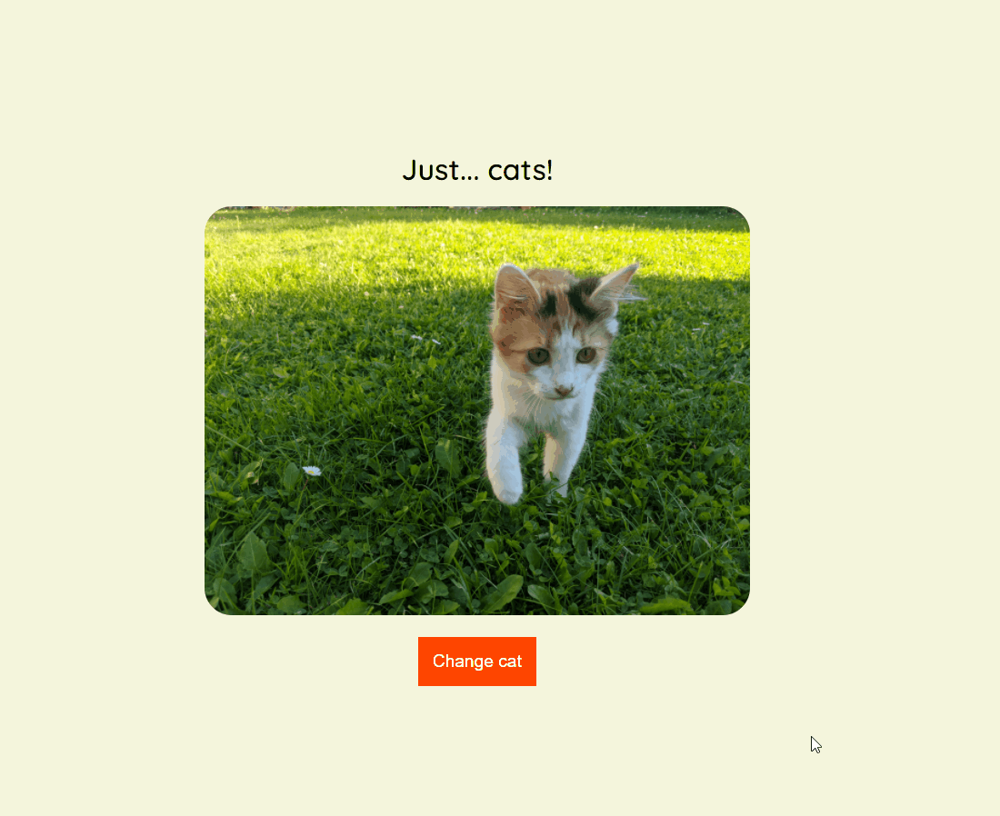

# Javascript Assíncrono

Este repositório contém a atividade prática do Curso "Javascript Assíncrono", que faz parte do Basecamp de Javascript [Digital Innovation One](https://digitalinnovation.one/).

## Atividade: API "catAPI"

Nesta atividade, vamos criar uma página que carrega fotos aleatórias de gatinhos sempre que clicamos em um botão.

1. Utilize a API `https://cdn2.thecatapi.com/images/cjh.jpg` para fazer as chamadas com o método `fetch()`; (ver documentação -> https://www.freepublicapis.com/the-cat-api)
2. Utilize seus conhecimentos na manipulação do DOM para criar a imagem e ativar o evento de clique do botão!

## Demo

